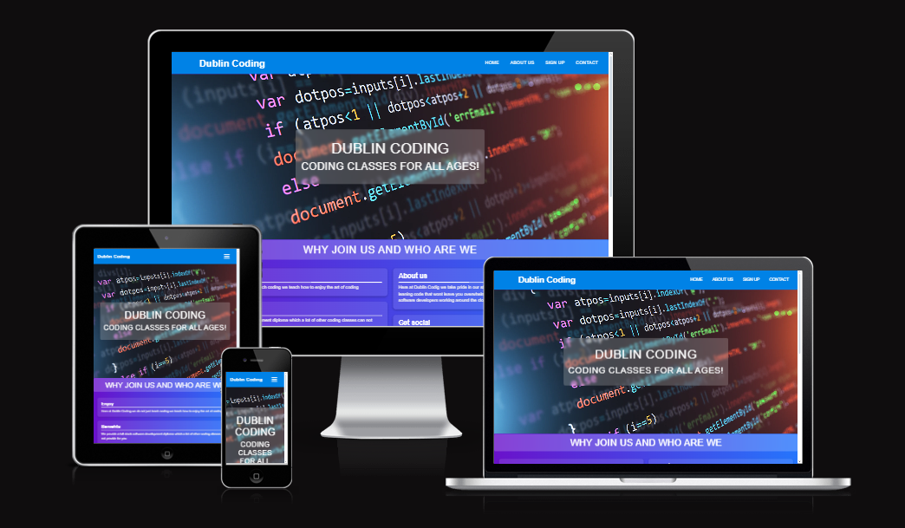
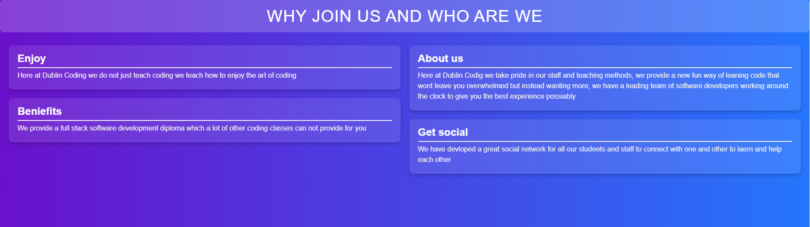
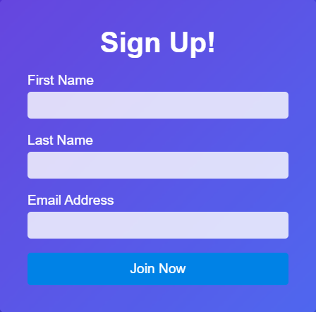

# Dublin Coding Website

Welcome to **Dublin Coding**, an educational platform offering coding classes for all ages. This website provides essential information about our services, benefits, and the sign-up process. It also includes convenient links to our social media channels, encouraging engagement with our community.


## Table of Contents

1. [Project Overview](#project-overview)
2. [Features](#features)
3. [Technologies Used](#technologies-used)
4. [How to Use](#how-to-use)
5. [Credits](#credits)
6. [Bugs](#bugs)
7. [Validator](#validator)
8. [Deploymeny](#deployment)
9. [Code Structure](#code-structure)

---

## Project Overview

The **Dublin Coding Website** serves as the main digital presence for our coding school. It is designed to be intuitive, easy to navigate, and responsive across different devices. This site gives users quick access to information about our services, as well as a direct way to sign up for coding classes. It features:

- A clean, modern user interface
- Clear navigation for improved user experience
- A responsive design adaptable to all screen sizes (desktop, tablet, and mobile)
- Integration with social media platforms to foster community engagement

---

## Features

### 1. Responsive Navigation Bar

- The top navigation bar includes links to important sections: Home, About Us, Sign Up, and Contact. 
- On mobile devices, the navigation transforms into a hamburger menu for ease of access, improving the user experience on smaller screens.

### 2. Intro Section

- A welcoming introduction to **Dublin Coding**, highlighting our core offering: **coding classes for all ages**. This section is designed with large, bold text and is the first point of contact for new users.

### 3. About Us Section

- Provides detailed information about **Dublin Coding**, including why users should join, the benefits of our programs, and an overview of our teaching philosophy.
- Key highlights include:
  - **Enjoy Coding**: We focus on making coding enjoyable for all.
  - **Full Stack Diploma**: Unique to our offering, we provide a full-stack development diploma.
  - **Expert Staff**: Learn from industry-leading software developers.
  - **Community Engagement**: A thriving community for both students and staff.

### 4. Sign-Up Form

- A simple and easy-to-fill form for users interested in signing up for classes.
- The form collects the user's first name, last name, and email address.
- The form data is submitted via the `POST` method to an external service for processing (`https://formdump.codeinstitute.net`).

### 5. Footer with Social Media Links

- The footer provides quick access to our social media pages on Facebook, Twitter, YouTube, and Instagram.
- Each icon is equipped with `aria-label` attributes to improve accessibility for screen readers.

### 6. Accessibility Features
- The website has been built with accessibility in mind, ensuring that users of all abilities can interact with the content.
- All images and interactive elements include descriptive `aria-label` tags.

---

## Technologies Used

### 1. Frontend
- **HTML5**: The latest standard for structuring web content.
- **CSS3**: For styling and layout, including responsive design with media queries.
  
### 2. Libraries
- **Font Awesome**: For including icons in the social media section.
- **Google Fonts**: (if used for typography) to enhance the visual aesthetics of the website.

### 3. Tools
- **Git**: For version control.
- **GitHub**: For hosting and collaboration.

## How to Use

### Navigation
- The navigation menu links to the main sections: **Home**, **About Us**, **Sign Up**, and **Contact**.
- On smaller screens, the hamburger menu appears to improve accessibility for mobile users.

### Sign-Up Form
1. Fill out your first name, last name, and email address in the form provided.
2. Click **Join Now** to submit the form. The form data is submitted to an external endpoint.

### Social Media
- You can connect with **Dublin Coding** via the social media links in the footer. Each link opens in a new tab for easy access.

---

## Bugs

### Known Issues
1. Navigation Menu not closing on click (moblie view)

-Description: On mobile devices, the navigation menu does not automatically close when a link is clicked.

2. Social Media Icons bot showing for mobile view

-Description: The social media icons in the footer may not be fully accessible to all screen readers.

---

## Validator
Html5 has been validated using Nu Html Checker (no errors)

Css3 has been validated W3C CSS Validator results for TextArea (CSS level 3 + SVG) (no errors)

## Deployment
The site was deployed to GitHub Pages. The steps to deploy are as follows:

In the GitHub repository, navigate to the Settings tab.

From the source section drop-down menu, select the Master Branch.

Once the master branch has been selected, the page will be automatically refreshed with a detailed ribbon display to indicate the successful deployment.

The live link can be found here - https://pauld95-git.github.io/Portfolio-1/

---

## Credits

Navbar inspired by CodingNepal - codingnepalweb.com.

Image taken from - https://www.themuse.com/advice/10-free-classes-to-learn-to-code-if-you-have-absolutely-no-idea-where-to-start scanrail/Getty Images.

---

## Code Structure

```plaintext
dublin-coding/
│
├── assets/
│   ├── css/
│   │   └── style.css        # Main CSS stylesheet for the website
│   └── images/              # (Optional) Folder for images if added
│
├── index.html               # Main HTML file for the website
└── README.md                # Documentation file

